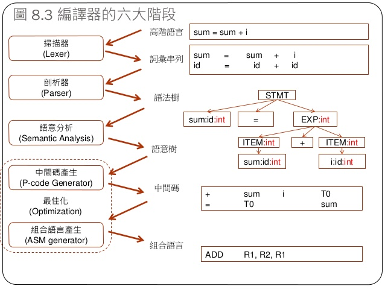

# C4虛擬機簡介說明  期末報告

#### 申明
程式碼來源自[陳忠誠老師改編的程式](https://gitlab.com/ccc109/sp/-/blob/master/C1-c4/c4.c)，借由網路資料讀懂程式碼、了解其運作方式，並加以說明。

## 簡介
C4 是 Robert Swierczek 寫的一個小型 C 語言編譯器，全部 527 行的原始碼。

C4 Compiler 不僅是個 C self-host compiler，它也啟發了許多人去撰寫自己的 Compiler，甚至是個了解 Compiler 很好的入門磚。

C4 編譯完成後，會產生一種《堆疊機機器碼》放在記憶體內，然後 虛擬機 會立刻執行該機器碼。其最特別的功能在於他能自我編譯。

## 編譯器

* 簡介

它主要的目的是將便於人編寫、閱讀、維護的進階電腦語言所寫作的原始碼程式，翻譯為電腦能解讀、執行的低階機器語言的程式，也就是執行檔。

編譯器將原始程式作為輸入，翻譯產生使用目標語言的等價程式。

* 流程---原始碼到輸出

原始碼（source code）→ 預處理器（preprocessor）→ 編譯器（compiler）→ 組譯程式（assembler）→ 目的碼（object code）→ 連結器（linker）→ 執行檔（executables），最後打包好的檔案就可以給電腦去判讀執行了。

* 圖例



* 分類

編譯器的一種分類方式是按照生成代碼所執行的系統平台劃分，這個平台稱為目標平台

* 本地編譯器

將執行於與編譯器所在相同類型的電腦和作業系統之上

* 交叉編譯器

輸出可以執行於不同的平台之上的編譯器。由於嵌入式系統通常沒有軟體開發環境，因此，為這類系統開發軟體時，通常需要使用交叉編譯器。


* 編寫 3 步驟
1. 詞法分析器，用於將字串轉化成內部的表示結構。
2. 語法分析器，將詞法分析得到的標記流生成一棵語法樹。
3. 目的碼的生成，將語法樹轉化成目的碼。

#### gcc基本語法
* gcc之執行
    * 將 C 的原始碼編譯成執行檔------>gcc 程式檔.c
    * GCC 預設會執行編譯與連結，直接產生一個可以執行的程式，輸出至 a.out 這個檔案
* gcc只編譯不連結
    * GCC 預設會將 C 的原始碼編譯並連結，產生執行檔，若想讓編譯器只進行編譯、不要連結，可加上 -c 參數，這樣就會建立一個 object 檔：
    ```
    # 僅編譯、不連結，建立 obj 檔案
    gcc -c hello.c
    ```
    執行這行之後，就會產生一個 hello.o 檔案，後續若要進行連結，就可以使用這個 object 檔：
    ```
    # 連結產生執行檔
    gcc -o hello hello.o
    ```

* 定義巨集（Macro）
在開發中大型的程式時，開發者通常會使用一些巨集來處理各種的問題，例如除錯時會需要輸出詳細的訊息。
```
// macro.c
#include <stdio.h>
int main() {
  printf("Hello, world!\n");

#ifdef DEBUG
  printf("DEBUG is defined.\n");
#endif

  return 0;
}
```
>>ifdef  條件式函數
>>endif  結束條件式函數

## C4.c
* 程式碼
[C4.c](https://gitlab.com/ccc109/sp/-/blob/master/C1-c4/c4.c)來源自老師的gitlab

讀懂老師的程式碼，讀懂老師的程式碼，並了解其中文解釋之意義。

* 基本語法
[C4.c基本語法](https://gitlab.com/ccc109/sp/-/blob/master/C1-c4/C4%E7%B7%A8%E8%AD%AF%E5%99%A8%E7%9A%84%E8%AA%9E%E6%B3%95.md)
* c4.c編譯後的各指令意思(高階指令)
```
指令   意義                              實作

OPEN: open                              a = open((char *)sp[1], *sp);
READ: read                              a = read(sp[2], (char *)sp[1], *sp);
CLOS: close                             a = close(*sp);
PRTF: printf                            t = sp + pc[1]; a = printf((char *)t[-1], t[-2], t[-3], t[-4], t[-5], t[-6]);
MALC: malloc                            a = (int)malloc(*sp);
FREE: free                              free((void *)*sp);
MSET: memset                            a = (int)memset((char *)sp[2], sp[1], *sp);
MCMP: memcmp                            a = memcmp((char *)sp[2], (char *)sp[1], *sp);
```
透過這些高階指令， c4 就不需要自行處理《記憶體、輸出入、檔案》等事項，而是將這些工作轉交 C 語言函式庫來處理。

C4 的虛擬機是一種堆疊機，包含累積器 a, 堆疊暫存器 sp, 框架暫存器 bp 。其中所有 +-*/ 等運算幾乎都是對 a 進行的，而 bp 則可被用來存取區域變數。

* 機械指令
```
指令   意義                                                    實作

LEA : load local address 載入區域變數                          a = (int)(bp + *pc++); 
IMM : load global address or immediate 載入全域變數或立即值     a = *pc++;
JMP : jump               躍躍指令                              pc = (int *)*pc;
JSR : jump to subroutine 跳到副程式                            *--sp = (int)(pc + 1); pc = (int *)*pc;
BZ  : branch if zero     if (a==0) goto m[pc]                 pc = a ? pc + 1 : (int *)*pc;
BNZ : branch if not zero if (a!=0) goto m[pc]                 pc = a ? (int *)*pc : pc + 1;
ENT : enter subroutine   進入副程式                            *--sp = (int)bp; bp = sp; sp = sp - *pc++;
ADJ : stack adjust       調整堆疊                              sp = sp + *pc++;
LEV : leave subroutine   離開副程式                            sp = bp; bp = (int *)*sp++; pc = (int *)*sp++;
LI  : load int           載入整數                              a = *(int *)a;
LC  : load char          載入字元                              a = *(char *)a;
SI  : store int          儲存整數                              *(int *)*sp++ = a;
SC  : store char         儲存字元                              a = *(char *)*sp++ = a;
PSH : push               推入堆疊                              *--sp = a;
OR  : a = a OR pop       pop 代表從堆疊中取出一個元素           a = *sp++ |  a;
XOR : a = a XOR pop                                           a = *sp++ ^  a;
AND : a = a AND pop                                           a = *sp++ &  a;
EQ : a = a EQ pop                                             a = *sp++ == a;
NE : a = a NE pop                                             a = *sp++ != a;
LT : a = a LT pop                                             a = *sp++ <  a;
GT : a = a GT pop                                             a = *sp++ >  a;
LE : a = a LE pop                                             a = *sp++ <= a;
GE : a = a GE pop                                             a = *sp++ >= a;
SHL : a = a SHL pop                                           a = *sp++ << a;
SHR : a = a SHR pop                                           a = *sp++ >> a;
ADD : a = a ADD pop                                           a = *sp++ +  a;
SUB : a = a SUB pop                                           a = *sp++ -  a;
MUL : a = a MUL pop                                           a = *sp++ *  a;
DIV : a = a DIV pop                                           a = *sp++ /  a;
MOD : a = a MOD pop                                           a = *sp++ %  a;
EXIT : 終止離開                                                return *sp;
```


* 特色
    * 可主動編譯自己
    * 以堆疊為主要的框架，將資料儲存於記憶體內
    以下是 C4 編譯器的用法，C4 可以進行《自我編譯》:

    ```
    gcc -m32 -o c4 c4.c  (you may need the -m32 option on 64bit machines)
    ./c4 test/hello.c
    ./c4 -s test/hello.c

    ./c4 c4.c test/hello.c
    ./c4 c4.c c4.c test/hello.c
    ```

* 使用方法
    * 用 gcc 編譯 C4

    ```
    $ gcc -m32 c4.c -o c4
    ```
    * 以test來測試程式編譯，這裡以hello來做範例
        * [hello.c](../test/hello.c)

        ```
        $ ./c4 test/hello.c
        hello, world
        exit(0) cycle = 9

        $ ./c4 -s test/hello.c       // 加上 -s 參數可以印出組合語言
        1: #include <stdio.h>
        2:
        3: int main()
        4: {
        5:   printf("hello, world\n");
            ENT  0
            IMM  8454232
            PSH
            PRTF
            ADJ  1
        6:   return 0;
            IMM  0
            LEV
        7: }
            LEV

        $./c4 -d test/hello.c       // 加上 -d 參數可以印出執行過程
        1> ENT  0
        2> IMM  6946904
        3> PSH
        4> PRTF
        hello, world
        5> ADJ  1
        6> IMM  0
        7> LEV
        8> PSH
        9> EXIT
        exit(0) cycle = 9
        ```


* 參考資料
[老師的c4.c](https://gitlab.com/ccc109/sp/-/tree/master/C1-c4)<br>
[gcc編譯器基本使用](https://blog.gtwang.org/programming/gcc-comipler-basic-tutorial-examples/)<br>
[原創程式碼](https://github.com/rswier/c4)<br>
[C in four function (c4) Compiler](https://hackmd.io/@srhuang/Bkk2eY5ES)<br>

## 補充
### 野指標
如果宣告指標但不指定初值，則指標儲存的位址是未知的，存取未知位址的記憶體內容是危險的。會造成不可預知的結果(隨機指向)，最好為指標設定初值，如果指標一開始不儲存任何位址，可設定初值為 0。

* 例子
```
int *p; 
*p = 10;
```
### fread()參數用法
```
size_t fread(void *ptr, size_t size, size_t nmemb, FILE *stream)
```
* ptr -- 这是指向带有最小尺寸 size*nmemb 字节的内存块的指针。
* size -- 这是要读取的每个元素的大小，以字节为单位。
* nmemb -- 这是元素的个数，每个元素的大小为 size 字节。
* stream -- 这是指向 FILE 对象的指针，该 FILE 对象指定了一个输入流。

### 指標與陣列
在宣告陣列之後，使用到陣列變數時，會取得首元素的位址。陣列索引其實是相對於首元素位址的位移量，下面這個程式以指標運算與陣列索引操作，顯示出相同的對應位址值：
```
#include <stdio.h>
#define LEN 10

int main(void) {
    int arr[LEN] = {0};
    int *p = arr;

    for(int i = 0; i < LEN; i++) {
        printf("&arr[%d]: %p", i ,&arr[i]);
        printf("\t\tptr + %d: %p\n", i, p + i);
    }

    return 0;
}
```
* 顯示結果
```
&arr[0]: 0061FEA0               ptr + 0: 0061FEA0
&arr[1]: 0061FEA4               ptr + 1: 0061FEA4
&arr[2]: 0061FEA8               ptr + 2: 0061FEA8
&arr[3]: 0061FEAC               ptr + 3: 0061FEAC
&arr[4]: 0061FEB0               ptr + 4: 0061FEB0
&arr[5]: 0061FEB4               ptr + 5: 0061FEB4
&arr[6]: 0061FEB8               ptr + 6: 0061FEB8
&arr[7]: 0061FEBC               ptr + 7: 0061FEBC
&arr[8]: 0061FEC0               ptr + 8: 0061FEC0
&arr[9]: 0061FEC4               ptr + 9: 0061FEC4
```
